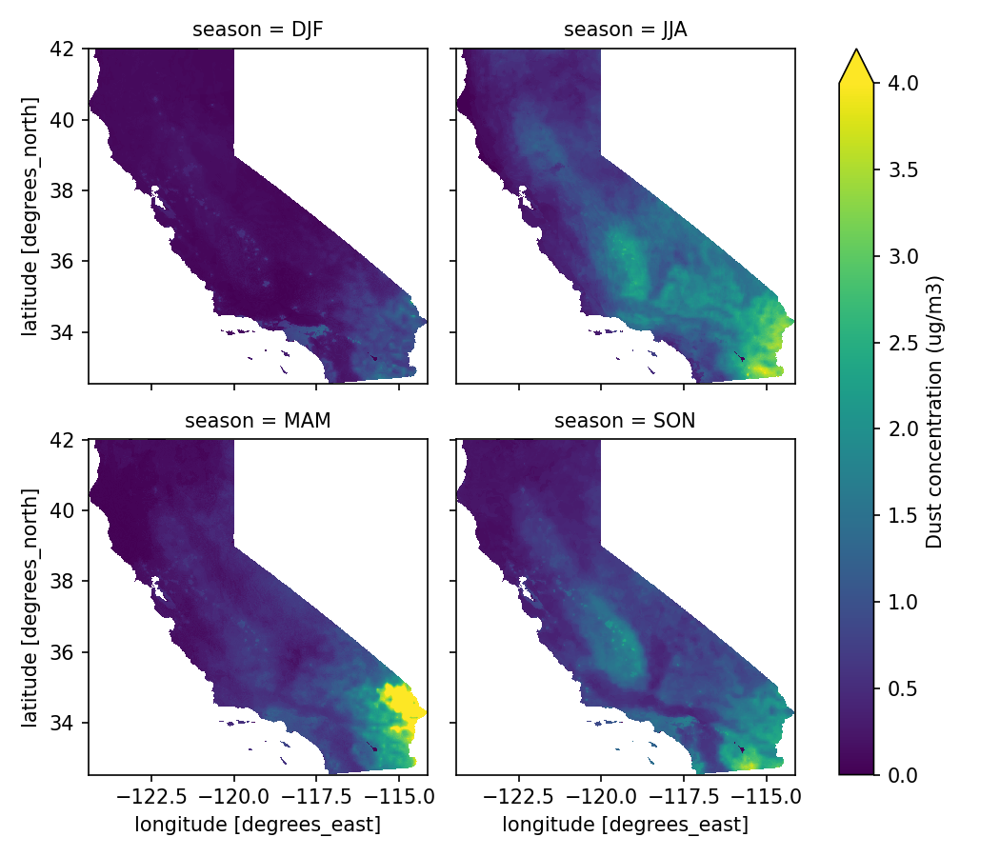
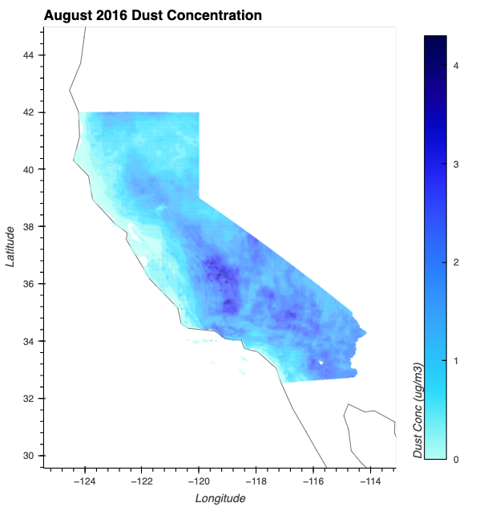

# Dust concentration trends in different land use types 
Compute the fraction dust concentration per land use type within each pixel across coccidiomycosis endemic regions in California. Analysis is performed monthly using the monthly dust concentration rasters and yearly land use type rasters.




## Data 
- **Monthly dust concentration**: This dataset was produced from a combined geoscience-statistical method outlined in van Donkelaar et al. (2019) and is made [publicly available on Box](https://wustl.app.box.com/s/wk3144jc6xfy6ujfvyv5m2yfk33nz2nn/folder/136086352053) from Washington University in St. Louis. 
- **Yearly land use maps**: We use the Cropland Data Layers (CropScape) as our source of yearly land use types. This dataset was downloaded from https://nassgeodata.gmu.edu/CropScape/. When performing the data download, the CropScape data was subsetted to the state of California and projected to a lat/lon (WGS83) grid using the tools on the user interface.
- **CA counties shapefile**: 2016 TIGER/Line Shapefile of the various counties in California, used for subsetting to endemic counties. Shapefile publically available from the [California open data portal](https://data.ca.gov/dataset/ca-geographic-boundaries#).

## Contact 
Nicole Keeney<br>
UC Berkeley School of Public Health, Department of Environmental Health Sciences<br>
Email: nicolejkeeney@gmail.com<br>

## Data exploration in python
Since I'm more familiar using python for data visualization of netcdf files, I created a Jupyter Notebook, titled `WUSTL_data_exploration.ipynb`, to explore the WUSTL dust concentration data using xarray, hvplot, cartopy, and matplotlib.For example, you can use hvplot to create an interactive visualization of each month of data. Below is a static png image of the dust concentration for the month of August. In the notebook, I also include code to generate an interactive plot that shows dust concentration for each month in 2016 (I've generated it at a lower resolution to reduce runtime). In the `data/figs` folder, you can find the interactive plot as an html file, which can be opened in your browser easily from your personal computer, along with the static png file of one month of data (displayed below), and the seasonal dust concentration means (displayed at the top of this page). 



### Running the notebook: conda environment
I've included an environment file with the repository that includes all the neccessary python dependencies to run the notebook. This can be used to set up the environment on your local computer so that you have all the required dependencies needed to run the notebooks. You'll need anaconda and python installed on your computer first. <br><br> 
To create the environment, run the following in the command line: 
```
conda env create -f environment.yml
```
To activate the environment, run the following in the command line: 
```
conda activate py_dust_env
```
To launch the Jupyter Notebook environment: 
```
jupyter notebook
```

## Running the analysis in the Berkeley Savio HPC cluser 
The main analysis script is the R script `dust_analysis.R`, which needs to be run in savio. 

### 1) Log into savio using your username 
 1) Run `ssh nicolekeeney@hpc.brc.berkeley.edu` in your terminal to log in to savio, replacing nicolekeeney with your savio username

### 2) Clone the github repository to savio
 1) Follow the instructions [here](https://docs.github.com/en/authentication/keeping-your-account-and-data-secure/creating-a-personal-access-token) to generate a personal access token attached to your GitHub account. This will be a collection of random letters/numbers that you'll need to copy. You'll also need to decide what permissions to give the key; I checked most boxes, except the ability to delete the repo 
 2) Clone the repository by running the following in the directory where you want to store the repository (probably your user directory, i.e. scratch/users/nicolekeeney): <br>`git clone https://github.com/nicolejkeeney/dust_landuse_analysis` 
 3) After that, you'll be prompted to enter your GitHub username and a password. For the password, **input the personal access token, not your GitHub password.** 
 4) Cache your personal access token so you don't have to keep inputting it each time following the instructions. I've set it up using HTTPS, not SSH. Run `gh auth login` and input your username and personal access key 
### 3) Run the calibration script 
 1) Edit the `dust_analysis.R` script with the year you want to run the analysis for. Do this by changing the variable `year` at the top of the script under **--- USER INPUTS--**. You can also edit the months you want to run the analysis for; the default is `months <- 1:12` to perform the analysis for all 12 months in the year). 
 2) In terminal, from the repo directory, run `sbatch Rscript.txt`.
 3) If you want, check the job status using `squeue -u nicolekeeney`, replacing nicolekeeney with your savio username. 
